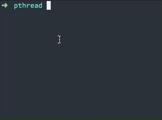

# Multithreaded in C

This is a tiny example to demo how to implement multithread in C.

The implementation using `pthread.h` library.

The two programs (`raw.c` and `thread.c`) does the same task: Increment the number `x` and `y` from `0` to `MAX_COUNT` (which was defined in `max.h`) and print the output to stdout whenever it finished.

Here is the two programs in action:



## How to run

Compile both program with:

```
make
```

Then run the `raw.c` by:

```
./raw
```

Run the `thread.c` by:

```
./thread
```
